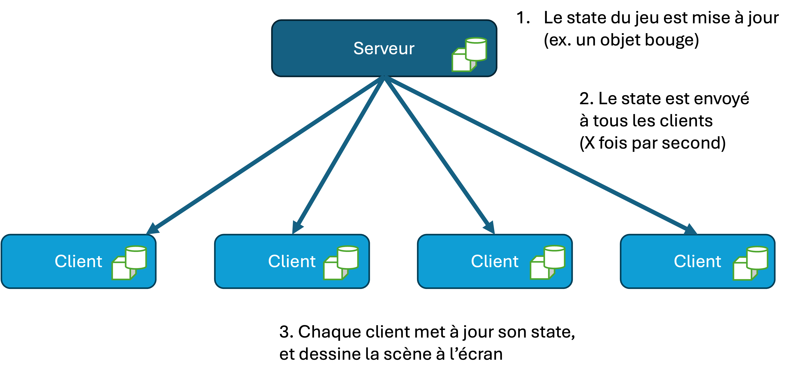
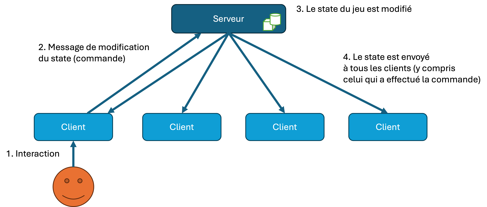
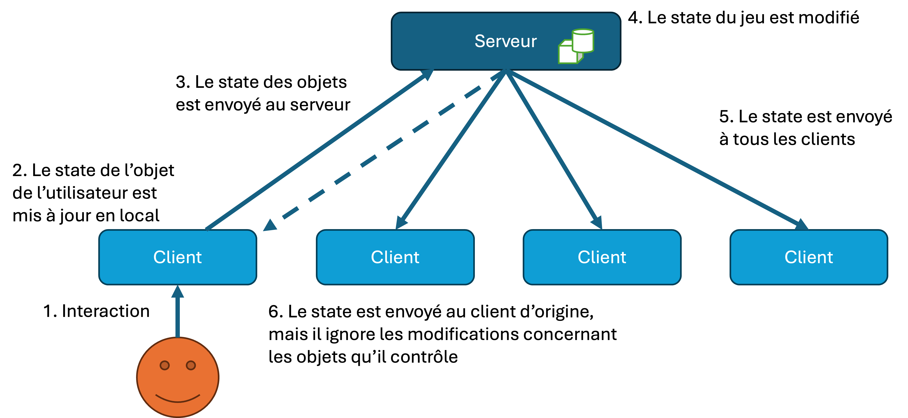
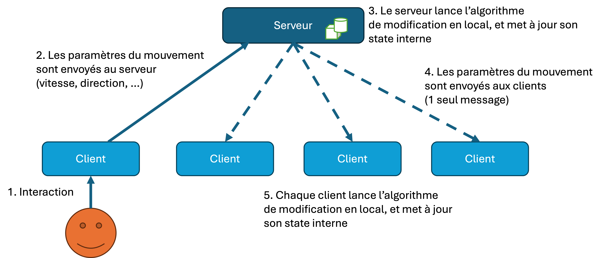
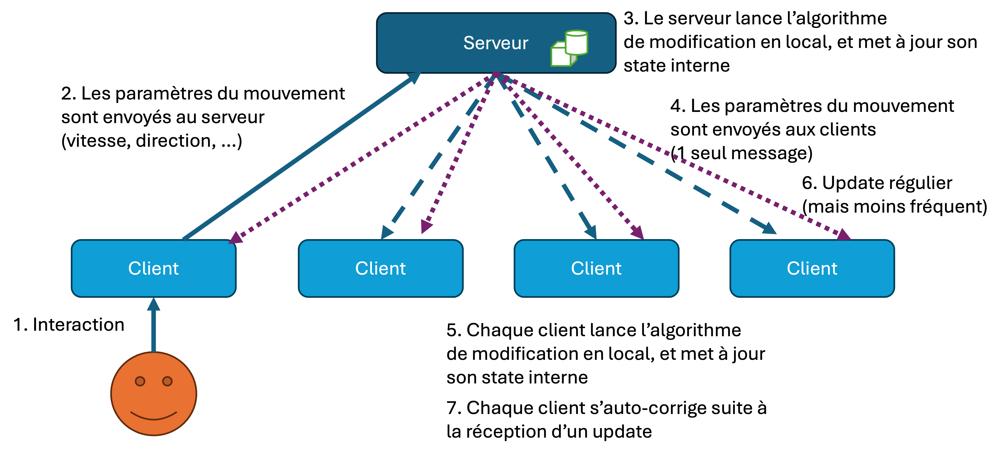

# Architecture

You will need to conceive an architecture for your networked game.

For this exercise, you will most likely use a client-server approach. (Peer-to-peer connections may also be used, but are more difficult to handle for massively online games).

In a client-server approach, you will typically develop 2 different applications :

## A server application

This application stores the global state of the game. This means it will store an internal representation of data such as :

- The transform (position, rotation, scale) of objects
- Parameters concerning dynamic objects
- Contents of the scene
- Scoring, life, inventory, ...
- ...

The application starts by listening on a specific port, and accept incoming connections (if TCP) or datagrams (if UDP).

When it updates its internal state, it should broadcast (or multi-cast, or send individual messages) about the updated state to connected clients.

The server application can be headless (that is, no graphical interface) or also have a rendering component for rendering a centralised view of the game.

## A client application

A client application typically needs the IP address and port of the server in order to function.

1. The IP address is manually entered, or automatically discovered via protocols such as Bonjour (Apple).
2. The client establishes a connection to the server.
3. The server sends the current state to the client
4. The client updates its own internal state accordinly
5. The client starts rendering the scene to the user's screen, accepting user interactions

Depending on the game, the client application may receive many update messages from the server, updating the internal state on the client.

The client may also send many update versions to the server, specifically concerning objects that the client directly controls (typically the user's avatar). The client may also send **commands** to the server (or Remote Procedure Calls (RPC)) that will trigger some game-logic directly on the server.

## Synchronisation paradigms

The game you will be developing is a real-time 3D application. This means there will be 3D objects that are continously moving, or are changing position as a result of user interactions. The objective is to ensure that all participating users see (approximately) the same version of the game at all times.

The strategy you use for synchronising your clients and your server depend on many factors that are specific to your game and your deployment:

- anticipated bandwidth available (is it a local connection via a LAN ? Is it over the Internet)
- the number of simultaneous connectionx
- networking conditions and latency
- the level of accuracy required
- ...

### The dumb client

The simplest strategy is to control the entire state on the server. The server sends position/rotation information for all dynamic objects to all clients at a high frequency. 

The client therefore performs no real state updates. It just receives and updates its internal state based on what it receives from the server.

But how to users interact with the game? Typically user interactions are translated into commands that are relayed to the server. The server interprets the command and updates the state. This state will eventually be updated at all clients.

This approach has a number of advantages :

- simple to implement
- the server also has the final say on how to interpret a command and update the state
- race conditions can be handled on a first-come, first-serve basis

However, there can be some serious disadvantages :

- The server needs to send a lot of messages to a lot of clients (at least 30 messages per second to maintain the illusion of animation). It will need a very large bandwidth to do this, and does not scale well.
- Users often feel the latency between their input and the final result appearing on the screen. They have to wait for the command to reach the server, be processed and for the next update to arrive from the server.



It may be possibly to reduce bandwidth usage using a number of heuristics. For example, we only send updates if an object has moved, or is moving. However, this may create other problems for clients that may not have received the last update message for an object.

Another strategy would be to send update messages only for objects within the vicinity (or view) of a client. You would however need to manage how to tell the server where your camera is, and what it is looking at, and also how to update stale state that may come back into view.



### Client with local control

One strategy to avoid latency for a user is to take control, on the client, of the objects the user controls.

The idea is that part of the state is "owned" by the client. The client then is the one that sends regular updates about its own objects to the server, or even perhaps directly to other clients.

The server updates its internal state, and broadcasts the update to the other clients.

The major advantage of this approach is that the user immediately sees results of his actions, without waiting for the response from the server, allowing for a much more fluid experience.



This is absolutely crucial for any VR or AR experience, where latency between an interaction and the visual result can cause nausea.



But can you see the difficulty with this approach ?

What if two different users both touch a "bonus" in the world on their local machines. Technically they both earn a point. But the bonus can only be accorded to one of the players. The server would have to decide who is the winner, and one of the players will end up not earning a point, even though visually he saw himself getting the point!

### Parameterisation

One solution to avoid sending many update messages would be to rather send the parameters of the movement to all clients at the start of a movement, and let each client calculate and update its internal state locally.

This is a huge saving in terms of bandwidth, since now we only need to send one message with the parameters for the movement (such as speed, direction, acceleration, etc.), and each client implements the algorithm locally.

However, this is the most difficult to control, especially given variable latency between the client that emits the initial command and the starting time on the server and each client. Indeed, even half a second delay can cause objects to end up at wildly differing positions on the different clients!

### Reckoning algorithms

To get around the problem of clients getting out of sync by combining regular (but less frequent) updates with parameterisation.

The idea is that objects continue to move locally until the client receives an update that corrects its state. 

We count on the fact that for the majority of objects, the error will be minimal, and that the corrections barely visible to the user.



Have you ever seen characters suddenly "teleport" from one position to another in your online games? It is a result of a paramterised error, finally resolved by an update!



[Dead reckoning](https://en.wikipedia.org/wiki/Dead_reckoning) in fact, is a technique used in navigation, robotics and networked games to try and anticipate the movement of objects based on their current parameters, and smoothly transition to the updated (correct) position when an update arrives.

## Messaging

Given this knowledge you can start to model the architecture of your game. You know you will need at least two applications, a server and a client. They will need to communicate with each other. But how ?

Your typical HTTP request will not do for this architecture. As you can see, the server is actively pushing updates to each client!

If you have used them before, you may be thinking about web-sockets... and you are on the right track. The idea of a web-socket is that we maintain an open connection between a client and server, so that the server can send data back to the client in real-time.

But why add the overhead of "web"-sockets, when we can just use plain old sockets!

For this project, we will move down the network stack and work directly with TCP or UDP to implement our synchronisation!