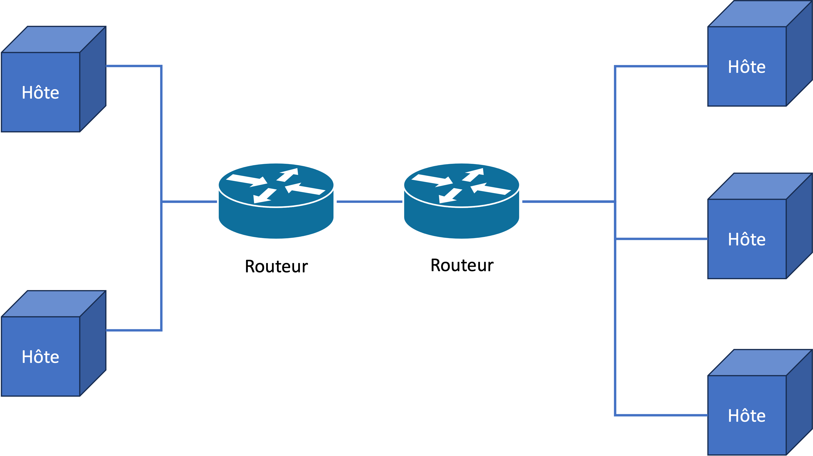

# Réseaux

LAN ? TCP ? Vous ne vous rappelez plus ce que c'est ?

Ici, nous construisons notre vocabulaire et boîte à outils avant le départ...

## Topologie

Quand on parle de "topologie", nous parlons surtout de l'architecture physique de notre réseau.

Comment plusieurs ordinateurs (**hôtes**) sont liés physiquement sur un réseau local (**LAN**), et comment un réseau local est connecté à un autre réseau local (**WAN**).

Une topologie contiendra plusieurs composants divers : 

- les différentes machines (PCs, portables, smartphones)
- le câblages de liaison (ex. fil torsadé, fibre-optique)
- les composants de connexion
  - **hub** (concentrateur)
  - **switch** (commutateur)
  - **routeur**
  - **point d'accès**


Hub, switch, routeur ([Youtube](https://youtu.be/1z0ULvg_pW8?si=TO0PxxLzrYykFhdB))


## Réseaux locaux - LAN

Un LAN - **local area network** est un ensemble d'hôtes qui sont tous connectés physiquement, typiquement par un câble ou un réseau radio local. 

Aujourd'hui, nous rencontrons pour la plupart deux configurations principales :

- **Ethernet** : connexions par câble physique (prise RJ45 / fil torsadé), utilisant le protocole CSMA/CD (**Carrier Sense Multiple Access with Collision Detection**), défini par la norme IEEE 802.3.
- **WLAN/Wifi** : connexions par signal radio (2.4Ghz / 5Ghz), utilisant le protocole CSMA/CA (**Carrier Sense Multiple Access with Collision Avoidance**), définit par la norme IEEE 802.11

### CSMA/CD

On peut mesurer s'il y a déjà une transmission en cours (voltage sur le câble, fréquence, lumière sur la fibre). Si notre interface réseau ne détecte rien sur le câble, il commence sa transmission.

Il est possible que deux interfaces envoient leurs transmissions en même temps. Ils écoutent donc d'autres messages qui arrivent pendant leur transmission. Si c'est le cas, il abandonne la transmission. Il attend un temps aléatoire (**backoff**) et réessaye de nouveau dans un temps futur.

Pour la détection de collision et l'attente (résolution) se fond dans l'ordre de millisecondes et ne sont pas remarquables par un utilisateur.

Avantages :

- rapide
- simple et pas cher
- robuste et récupération est facile et rapide

Désavantages :

- fonctionne moins bien, plus la distance est longue entre les hôtes
- plus il y a des hôtes, moins bien le fonctionnement

### CSMA/CA

On ne peut pas mesurer de façon fiable des transmissions en cours sur une bande radio. Le protocole est donc plus restreint.

Une interface wifi va plutôt demander l'autorisation de lancer sa transmission via des signaux (*RTS - ready to send*, *CTS - clear to send*). Seulement quand il est autorisé, une interface commence à transmettre ses données.

Ceci ajoute plus de coût à la transmission, car il y a plus de négociation qui doit se faire entre les membres du WLAN.

Avantages :

- plutôt fiable. On ne gaspille pas de bande passante en résolvant des collisions.

Désavantages :

- moins performant en ce qui concerne la bande passante
- parfois des délais remarquables par l'utilisateur

## Sous-réseaux

Si la performance d'un LAN se dégrade plus, on ajoute des ordinateurs dessus, découpe notre topologie en créant des **sous-réseaux** (subnet).


Subnet masks ([Youtube](https://youtu.be/s_Ntt6eTn94?si=oMRSyAby_A6OiI-D))


