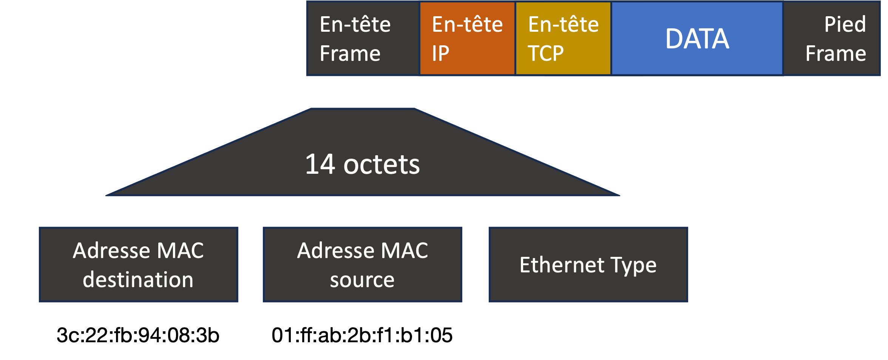

# Routing

# Routing : les fondamentaux

## Adresse MAC

Chaque carte réseau dispose d'un numéro unique qui l'identifie dans un réseau Local.

Quand une carte réseau transmet un paquet, autrement nomme un **frame** (quand on parle de la couche liaison), il existe des en-têtes qui précise l'émetteur et le receveur du message.



Quand le signal est transmis dans le LAN, chaque ordinateur sur le LAN va commencer à lire la transmission. C'est-à-dire, **chaque carte réseau va recevoir le même message**, même si le message n'est pas destiné à ces machines !

En revanche, chaque carte réseau lit uniquement les premiers octets, ceux qui décrivent l'adresse MAC de destination. Se cette adresse ne correspond pas à celle de la carte en train de lire le message, le message est donc ignoré. Seulement la carte avec l'adresse MAC correspondant passera le message plus haut dans la pile (couche IP).



Le dernier paragraphe n'est pas totalement vrai, mais présente une façon plus simple de comprendre le mécanisme. En réalité, la carte accepte chaque message, quelle que ce soit l'adresse MAC destination, et on a le moyen de lire les messages reçus sur le même LAN via un logiciel de surveillance comme WireShark.



Il y a différentes sortes d'adressage possibles :

* **Unicast** : l'adresse MAC de destination est une adresse unique
* **Multicast** : les premiers 3 octets de l'adresse de destination pourraient préciser si on envoie à plusieurs destinataires. Précisément, si les premiers 3 octets sont 01-00-5E, la carte réseau sait que les 3 octets suivants mentionnent le *group* destinataire.
* **Broadcast** : une destination de `FF-FF-FF-FF-FF-FF` sera acceptée par tous les ordinateurs du même LAN.
  
## Adresse IP vs Adresse MAC

Dans un réseau moderne, on affecte une adresse IP à chaque machine. Quand on envoie un paquet à un destinataire, on utilise son adresse IP. 

Donc, comment fait-il qu'une adresse IP est transformée en adresse MAC ?

Grâce au protocole **ARP** (**A**dress **R**esolution **P**rotocol).

Avec ce protocole, un ordinateur ou routeur garde un tableau associatif qui précise la relation entre les adresses IP qu'il connaît et des adresses MAC dans le réseau. 

Quand on veut envoyer un message à une adresse IP inconnue, un message **ARP** est diffusé (broadcast) sur le LAN, demandant "qui est le propriétaire de cetee adresse IP ?". La machine avec l'adresse IP demandée répond avec son adresse MAC.

La machine expéditeur met à jour son tableau associatif et procède à l'envoi du *frame*.


## Adresses IP : conventions

Toutes les adresses IP ne sont pas pareilles. Au fil du temps, nous avons créés des conventions pour parler des rôles ou actions spécifiques dans un réseau.

* **Broadcast** : si je veux envoyer un paquet à toutes les machines de mon LAN, typiquement, je fixe la partie *adresse* de l'IP à 1. Par exemple, pour un réseau avec un masque `255.255.255.0`, le dernier octet précise l'adresse de la machine sur le LAN. Envoyer un paquet à `192.168.8.255` avec ce masque va diffuser le message à toutes les machines du sous-réseau `192.168.8.*`. 

* **Passerelles et routeurs** : typiquement, on réserve l'adresse `1` d'un sous-réseau au routeur ou passerelle. Par exemple, pour un réseau `192.168.8.*` avec un masque `255.255.255.0`, l'adresse du routeur est typiquement `192.168.8.1`.

* **Réseaux locaux / privés** : Par convention, les gammes `192.168.*.*` et `10.*.*.*` sont réservées aux réseaux locaux ou LANs internes. Vous n'aurez jamais une adresse publique de ces gammes.

## Affectation automatique d'une adresse IP

Une adresse IP peut être affectée manuellement à une machine, directement en modifiant les paramètre du système d'exploitation. Mais le risque de conflit avec une autre machine est élevé.

Le protocole **DHCP** existe pour combattre ce problème. Dans les réseaux maison, le routeur commercial s'occupe aussi de DHCP, mais ceci n'est pas obligatoire. On peut installer DHCP sur une machine Linux par exemple.

En bref, le protocole DHCP fonctionne de la manière suivante :

- Une machine ne connaît pas encore son adresse IP, et DHCP est activé. 
- Il diffuse un message sur le LAN, type "qui suis-je ?" 
- Si un serveur DHCP existe sur le LAN, il va accepter le message et consulter son tableau associatif interne.
  - L'adresse MAC est connu, et a déjà une adresse IP affectée manuellement (*adresse statique*)
  - L'adresse MAC n'est pas connue. Une adresse IP libre dans une gamme d'adresses disponibles est sélectionnée et enregistrée dans un tableau.
- L'adresse IP est retourné à la machine, avec d'autres informations pratiques comme le masque du sous-réseau, le router, les DNS à utiliser.

Le suivant est un exemple d'une configuration d'un serveur DHCP sur Linux (`/etc/dhcp/dhcpd.conf`) :


```
subnet 10.21.27.0 netmask 255.255.255.0 {
  range                           10.21.27.100 10.21.27.199;
  option domain-name-servers      10.21.27.253;
  option routers                  10.21.27.254;
  # Réservations DHCP
  host superlinux-eth {
          hardware ethernet 10:bf:48:13:f6:cc;
          fixed-address 10.21.27.100;
  }
  host superlinux-wlan {
          hardware ethernet 68:5d:43:2a:f3:af;
          fixed-address 10.21.27.101;
  }
}
```

Ici, on voit qu'il y a 2 machines qui auront toujours la même adresse IP. Sinon, une adresse automatique sera choisie entre `10.21.27.100` et `10.21.27.199` pour toute machine inconnue.


## Au delà du LAN

Mais si un paquet doit voyager au-delà de notre LAN, vers l'Internet, par exemple ?

Plusieurs périphériques existent qui séparent des LANs en plusieurs :

- un *switch* qui va séparer des LANs en utilisant les masques de sous-réseau (subnet-mask). Un switch par définition et "passif", dans le sens où il va juste lire l'adresse IP destinataire, et en fonction des masques définis retransmettre le message sur le bon fil correspondant. On n'adresse pas un message à un switch, par exemple.
- un *routeur* qui va décider quelle est la meilleure route à prendre pour atteindre sa destination. Un routeur est actif, dans le sens où on adresse spécifiquement des messages au routeur pour transmission plus loin.

Comment ça fonctionne ?

Avez-vous remarqué dans la configuration des votre réseau sur votre PC qu'il faut préciser le "Router" ou "Passerelle" (**default gateway**) ?

Quand mon PC veut envoyer un message à google.com, par exemple, le suivant est fait :

- on interroge le DNS, qui retourne l'adresse IP correspondant à google.com.
- la machine compare cette adresse IP à son masque de sous-réseaux
- la machine détermine qu'en effet, l'adresse n'est pas sur son sous-réseau.
- la machine envoie le message directement au **routeur** (en utilisant l'adresse MAC trouvé via ARP)
- le routeur accepte le message, lit l'adresse IP destinateur
- le routeur consulte son tableau de routage pour décider l'adresse IP de la machine suivant

Ce tableau de routage se construit automatiquement via des protocoles entre routeurs. Par exemple :

- *OSPF* : Open Shortest Path First
- *BGP* : Border Gateway Protocol
- etc.

En sommaire, des messages sont échangés entre les routeurs, contenant des caractéristiques du réseau et les tableaux de routage connu par les autres. Ceci ce fait régulièrement, permettant une adaptation automatique aux sinistres (coupure de connexion, etc)

Ok, oui, on a récupéré un grand tableau d'adresses, mais où envoyer les paquets ? Finalement, on se repose sur des algorithmes inspirés de Dijkstra pour calculer la prochaine étape :


L'algorithme Dijkstra



Le routeur effectue une opération qui s'appelle **NAT** (**N**etwork **A**dress **T**ranslation) quand il transfère notre message. En effet, il renvoie notre message en indiquant son **adresse publique** comme expéditeur. 

Regarder pour l'école :

[What's my IP address ?](https://whatismyipaddress.com)

Quand google répond, il répond en précisant l'adresse IP de notre routeur comme destinataire !

Le message est routé vers notre routeur, qui aura gardé une trace de notre requête initiale dans un tableau. À la réception de la réponse, la correspondance est faite, et le routeur répète la réponse sur le LAN, avec notre machine comme destinataire.