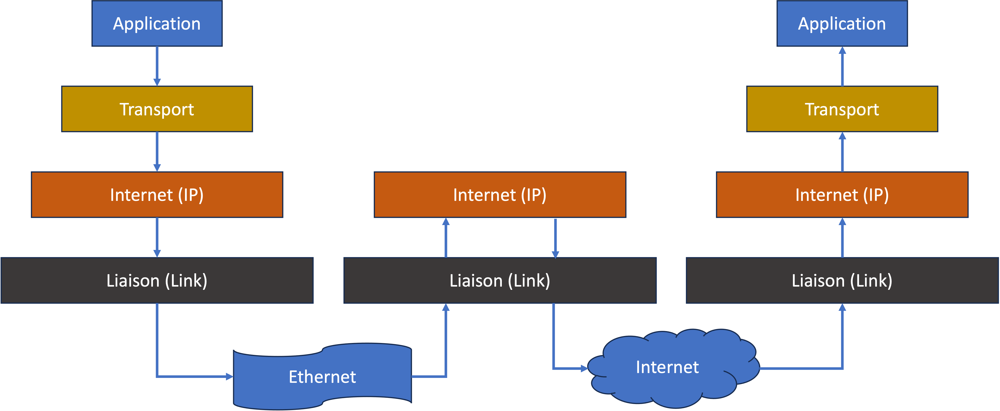
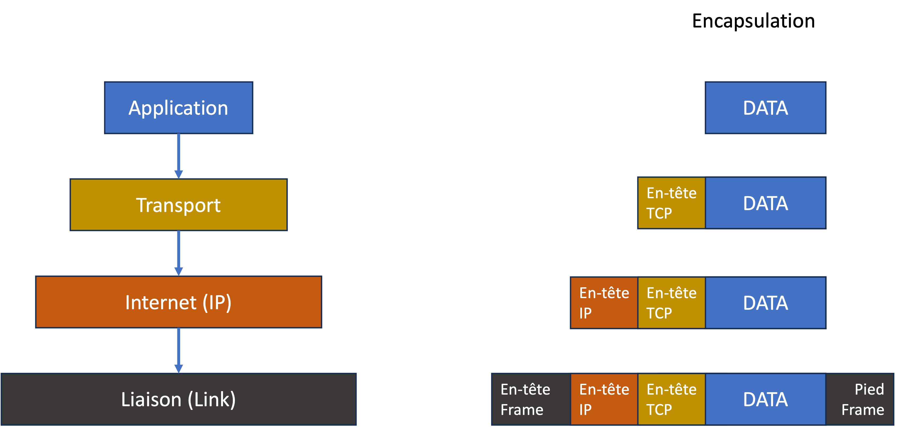

# La pile TCP/IP

Au début de l'âge des communications Internet, on a créé le [modèle OSI](https://fr.wikipedia.org/wiki/Mod%C3%A8le\_OSI) pour définir le fonctionnement des réseaux.

Aujourd'hui, certains sous-sets (ou implémentations du modèle OSI) ont pris le dessus. Nous parlons donc plus souvent du modèle TCP/IP.



Le principe :

_Chaque couche du modèle ne se concerne pas des autres couches (au-dessus ou en dessous) dans la pile._

Les couches :

* **Application** : les protocoles pour établir des tunnels de transmission (soit fiable ou non fiable) vers d'autres processus, pour accomplir un objectif business ou applicative. Les processus impliqués sont adressés par des _ports_. Exemples :
  * HTTP : initialement pour la transmission fiable des pages de texte (**hypertext**) entre deux ordinateurs, aujourd'hui étendu pour la transmission des médias
  * SMTP : pour la transmission des e-mails
  * FTP : pour la transmission des fichiers
  * ... ou bien, n'importe quel protocole sur mesure entre deux applications
* **Transport** : les protocoles pour transmettre des données entre 2 hôtes, de façon fiable ou non fiable
  * TCP : pour la transmission fiable avec contrôle de flux, etc.
  * UDP : pour la transmission non fiable, mais rapide
* **Internet** : les protocoles pour la transmission des paquets au-delà des frontières des réseaux. Cette couche crée une abstraction sur la vraie topologie des réseaux, fournit un adressage unifié et global.
  * IP : adressage et routing
* **Liaison** : les protocoles pour la transmission sur le réseau local
  * Ethernet

## Encapsulation

On appelle une unité de communication à envoyer sur le réseau un *paquet*. En envoyant un paquet vers une autre machine, ce paquet traverse la pile de haut en bas, à chaque fois en augmentant le paquet avec des informations nécessaires pour pouvoir le transférer vers sa destination.

Par exemple, une requête HTTP (fait par votre navigateur), est un paquet contentant simplement le texte du type suivant :

```http
GET /users HTTP/1.1
Content-Type: text/html
```

Ce paquet est ensuite passé à la couche en dessous, la couche "Transport", qui rajoute des informations supplémentaires au paquet pour assurer la transmission fiable (dans l'ordre envoyé, et résistant aux fautes et pertes - le protocole TCP).

Ce paquet est passé à la couche en dessous, la couche "IP", qui ajoute des informations qui expliquent comment transférer ce paquet en dehors du réseau local (pour aller vers l'Internet, par exemple). Typiquement, on ajoutera dans cette couche des adresses IP de la passerelle du réseau local au besoin.

Ensuite, le paquet est passé à la couche en dessous, la couche "Liaison" ou "Physique". Cette couche s'occupe de la création d'un signal et la transmission vers un autre ordinateur physique, que ce soit par ondes radio, signaux électromagnétiques, ou fibre. 

Le paquet sera reçu par un *routeur*, qui lit les informations IP, et les modifie au besoin afin de le transférer au prochain routeur. 

Quand le paquet arrivera sur le LAN d'arrivée, sur la machine de réception, le paquet sera progressivement déballé jusqu'à son arrivée à l'application cible (dans notre cas, un serveur HTTP qui lit le message d'origine HTTP et renvoie une réponse.) 

