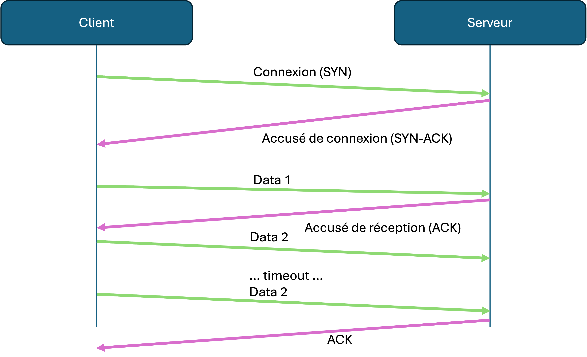

# TCP

TCP, or Transmission Control Protocol, is a connection-based protocol that ensures message deliverability.

The basis of TCP is that "connection" is kept open between two hosts via a number of administrative messages that are sent between them.

For example, a connection is establish after an initial handshake between the two machines. Note that they are not physically connected! There is still the internet with all its problems that lies between them !

However, TCP gives the illusion of a connection by regularly sending messages between the two hosts to make sure they are both still reachable. If no message is received after a certain time, TCP assumes that the other host has disconnected.

Another feature of TCP is that it sends messages **reliably** and **in order**, by requiring and acknowledgement of receipt (ACK) of that message, before sending the next one. If an ACK is not receives within a certain time, TCP will retry sending it until an ACK is received, or until a timeout signaling that the host has disappeared.






All HTTP requests use TCP for the transport layer. When we send a request to a server, a TCP connection is established, and we ensure that the request is sent reliably and in order. The same is true for the response. Once an HTTP request is done, the TCP connection is closed.




For game development, TCP could be considered to be too costly in terms of bandwidth, and may also introduce extra latency in our synchronisation.

Think about it. If we are sending 30 updates per second, is it really serious is we miss one or two ? Do we really want to wait for message X to be sent reliably or should be just skip it and move on ? 

Do we want to be overloading our network with ACKs for every update being sent?

Probably not, but is there a different way to send real-time messages without the overhead ? Yes ! UDP.

## TCP in C#/dotnet

The `System.Net.Sockets` library contains tools that encapsulate the TCP protocol for us.

We can create a TCP server that listens for incoming connections :

```c#
using System.Net;
using System.Net.Sockets;

...
public class MyServer {
    TcpListener tcp;

    public void StartServer() {
        tcp = new TcpListener(IPAddress.Any, ListenPort);
        tcp.Start();


    }

    public void Tick() {
        // Check for new connections
        while (tcp.Pending()) {
            TcpClient tcpClient = tcp.AcceptTcpClient();       
            Debug.Log("New connection received from: " + ((IPEndPoint)tcpClient.Client.RemoteEndPoint).Address);       
            
            // Do something with the new connection, like store it in a list or dictionary
            Connections.Add(tcpClient);     
        }

        // Listen for incoming messages on the connections
        foreach (TcpClient client in Connections) {           

            while (client.Available > 0)
            {   
                byte[] data = new byte[client.Available];
                client.GetStream().Read(data, 0, client.Available);

                try
                {
                   // ... do something with the data
                }
                catch (System.Exception ex)
                {
                    Debug.LogWarning("Error receiving TCP message: " + ex.Message);
                }
            }
        }

    }
    
}
```