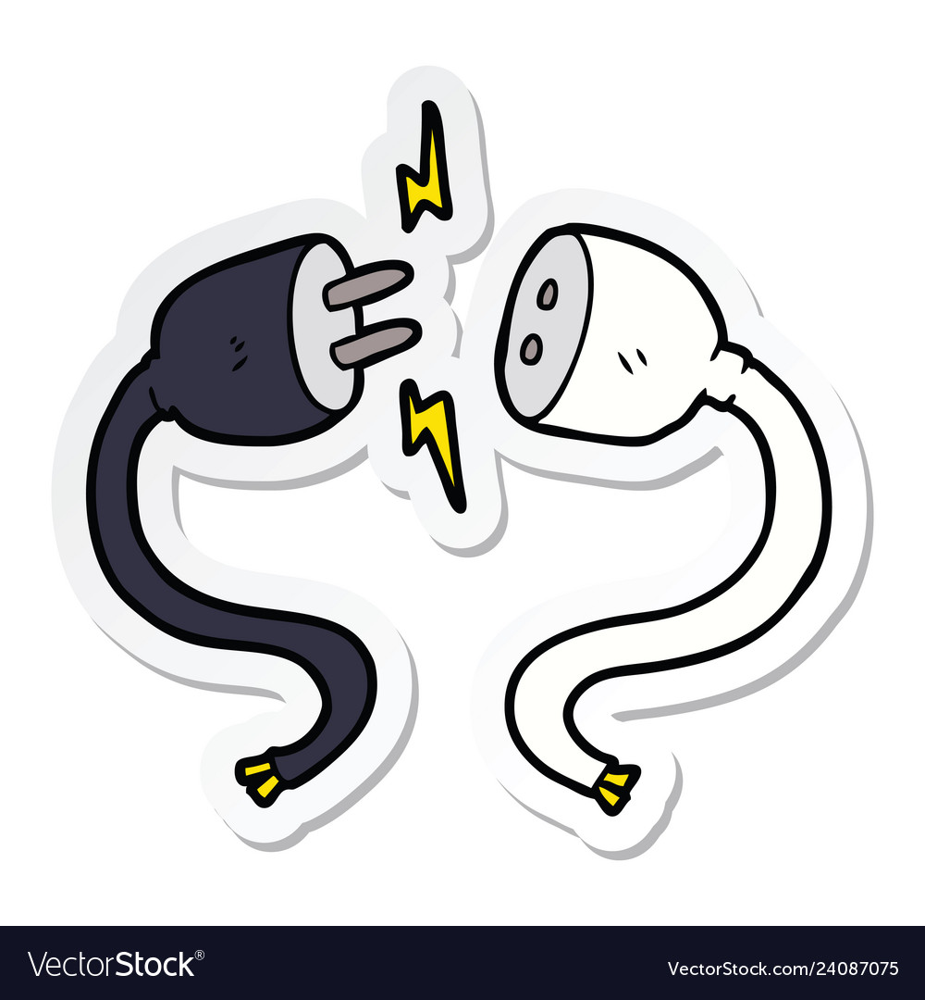

# TCP et UDP

Avec la couche IP, on peut maintenant adresser des paquets à d'autres machines.

Mais vous avez sûrement constaté qu'avec toute la puissance de routage automatique, il y a quand même des problèmes :

- des paquets pourrait arriver dans un ordre différent que l'ordre d'envoie
- certains paquets peuvent être perdus en cours d'acheminement

Pour certaines types d'application, on pourrait accepter ce genre de problème. Par exemple, un jeu vidéo qui envoie 25 paquets par seconde aux autre ordinateurs : on peut accepter que quelques paquets soit perdus, car un nouveau arrive aussitôt.

En revanche, pour la transmission d'un fichier, ceci n'est pas possible ! Comment reconstruire correctement le fichier l'autre coté si on manque d'information et si les segments du fichier arrive dans le mauvais ordre ?

Une fois un paquet reçu par la couche IP, notre ordinateur va regarder l'octet dans les en-têtes IP pour savoir la nature de son contenu. Ceci pourrait être TCP, UDP (ou d'autres protocoles comme ICMP, etc.).

En fonction du type de contenu, notre ordinateur implémente le protocole associé.

- **TCP** : Transmission Control Protocol, 
  - assure l'ordre d'arrivé des paquets (des octets réservés pour cela dans l'en-ête), 
  - utilise un système d'accusé de réception pour garantir l'arrivée de tous les paquets. Pour chaque paquet envoyé, l'émetteur attend une accusée de réception (**ACK**). Si aucun n'est reçu le message est renvoyé.
  - implémente la notion de *connexion* via l'échange de paquets **keepalive**... tant que les 2 parties continuent de recevoir ces paquets, on considère la connexion "ouverte".
- **UDP** : Uniform Datagram Protocol
  - paquets peuvent arriver dans n'importe quel ordre
  - paquets peuvent être perdus
  - paquets ont un taille maximale


TCP vs UDP


## Sockets

Qu'est-ce que c'est un Socket ?

Un des principes de Linux est que **tout est un fichier**. Nous avons déjà vu dans notre cour Unix Shell que, par exemple, on accède à un disque dur comme si c'était un fichier.

C'est la même chose pour envoyer/recevoir des données sur le réseau. 

Nous précisons qu'on aimerait, par exemple, écouter les paquets TCP sur le port 5050. Nous réservons un **socket** auprès du système d'exploitation. En bref, nous branchons notre processus à une prise :

Le système d'exploitation sait que tous les messages reçus par la couche IP pour le port 5050 doivent être redirigés vers notre processus. En plus, le système d'exploitation empêche qu'un autre processus réserve le même port !

Comment cela s'implémente coté Linux ? Simple, on crée un descripteur d'un fichier "virtuel" qui peut être écrit et lu comme n'importe quel fichier. Si le fichier est "ouvert", un autre processus ne peut pas l'ouvrir en même temps. Quand on écrit dans ce fichier, Linux redirige les données vers la couche IP. Pour écouter les messages, on surveille le fichier. Dès qu'il y a des nouvelles données qui arrivent, on lit le fichier.

Tous les langages de programmation ont une abstraction pour la création des sockets, par exemple, [NodeJS Net](https://nodejs.org/api/net.html).

En C ou C++, sur Windows, par exemple, on peut créer et utiliser les sockets grâce au DLL `winsock` ([WinSock](https://learn.microsoft.com/fr-fr/windows/win32/api/winsock2/nf-winsock2-socket)).



Faites un peu de recherche pour savoir si vous comprenez la différence entre un **socket** et un **web-socket**. C'est la même chose ? Différent ?



