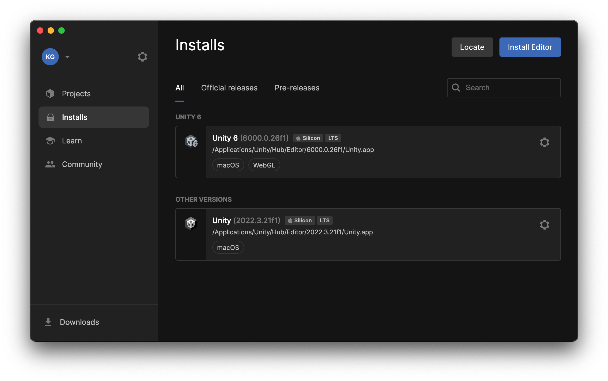
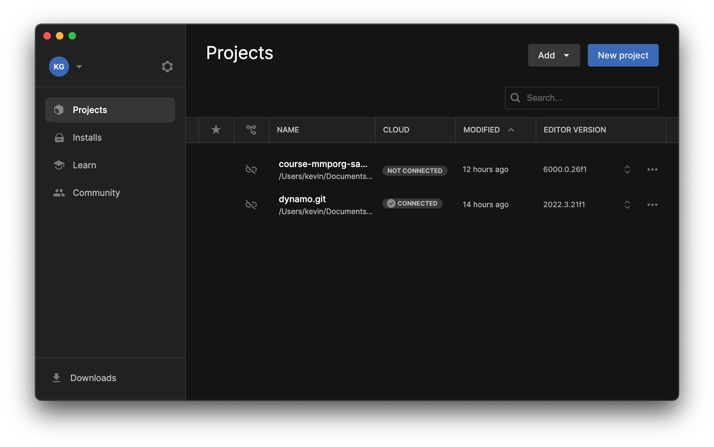
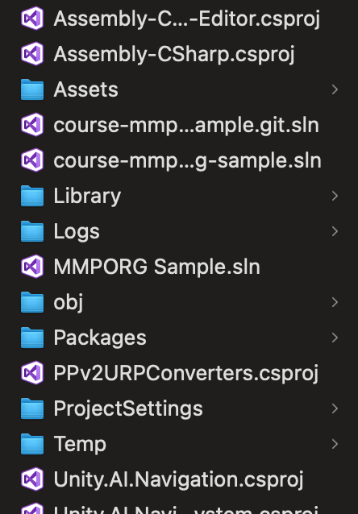
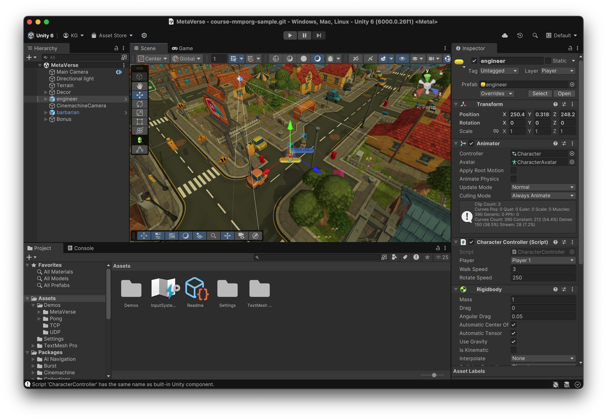
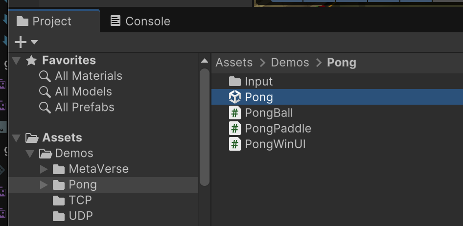
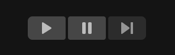
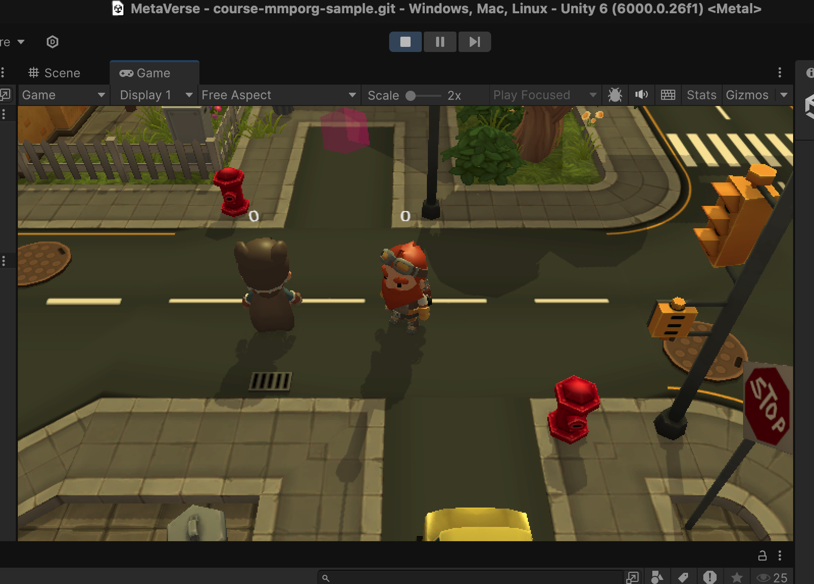

# Unity : les bases

Unity est un moteur de jeu 3D en temps réel. Il fournit un cadre dans lequel on peut rapidement construire des expériences interactives en temps réel, en fournissant un certain nombre de modules fondamentaux qui peuvent être réutilisés d'un jeu à l'autre :

- un éditeur visuel pour créer/modifier des scènes 3D
- des abstractions pour le rendu des graphiques 3D sur la carte graphique 
- des modules pour gérer les entrées de l'utilisateur (clavier, souris, manette de jeu, ...)
- des modules de génération de comportement : physique, animation
- une boucle d'animation dans laquelle nous pouvons insérer notre logique de jeu personnalisée
- ...


## Installer Unity Hub et un éditeur Unity

Commencez par télécharger [Unity Hub](https://unity.com/download), un logiciel spécial pour gérer nos installations et projets Unity.

Unity a de nombreuses versions différentes, et de nouvelles versions peuvent apparaître au cours du cycle de développement d'un même projet. Il peut être déconseillé de mettre à jour votre version d'Unity pendant le développement, c'est pourquoi Unity Hub nous permet d'ouvrir notre projet avec la bonne version d'Unity.

Pour utiliser Unity, vous devez créer un compte gratuit. Procédez ainsi et connectez-vous à Unity Hub.

Une fois connecté, allez dans le menu Installs, et cliquez sur « Install Editor ». Choisissez la dernière version de Unity et installez l'éditeur.




## Créer un nouveau projet

Pour créer un nouveau projet, ouvrez Unity Hub, naviguez jusqu'à l'élément de menu Projects, et cliquez sur New Project.



Unity fournit un certain nombre de modèles de jeu prédéfinis en fonction du type de jeu, de la plateforme cible, du type de rendu que vous souhaitez utiliser. Tous peuvent être modifiés ultérieurement.

Pour l'instant, vous pouvez choisir le modèle « Universal 3D ».

Il vous sera demandé de spécifier un emplacement sur votre disque pour votre projet unity.



Un projet unity est un ensemble de répertoires et de fichiers. Veillez à choisir un emplacement qui respecte les critères suivants :

- avoir suffisamment d'espace disque : au moins 1 Go d'espace
- ne pas utiliser de réseau ou de lecteurs partagés (comme Google Drive). Cela peut provoquer des erreurs inattendues !
- éviter les emplacements qui contiennent des caractères spéciaux ou des espaces dans le chemin d'accès. Cela peut provoquer des erreurs inattendues !



## Fichiers de projet et GIT

Vous remarquerez que Unity crée toute une structure de fichiers :



Certains fichiers sont importants pour votre projet, tandis que d'autres sont générés automatiquement par Unity.

Les fichiers importants à inclure dans votre contrôle de source sont :

- `Assets` : l'emplacement principal de tous vos scripts, modèles 3D, ...
- `Packages` : les dépendances de votre projet
- `ProjectSettings` : paramètres globaux du projet

Tout le reste peut être ignoré dans votre contrôle de source.

Voici un exemple de `.gitignore` que vous pouvez ajouter à la racine de votre projet :

```
/.vscode/
/Library/
/obj/
*.csproj
*.sln
/Temp/
/.vs/
/Log/
/Logs/
/Build/
/UserSettings/
```

Puisqu'un projet Unity contient beaucoup de médias, je vous conseille d'ajouter le fichier `.gitattributes` suivant à la racine de votre projet :

```
*.mov -delta
*.ogg -delta
*.ogv -delta
*.jpg -delta
*.png -delta
*.mp4 -delta
*.mp3 -delta
```

## Opening a project


J'ai fourni un exemple de projet avec plusieurs scènes de démonstration dans ce dépôt [https://github.com/glassworks/course-mmporg-sample](https://github.com/glassworks/course-mmporg-sample).

Pour ouvrir ce projet dans Unity, ouvrez Unity Hub, et cliquez sur le bouton « Add ». Naviguez jusqu'à la racine de mon projet, et sélectionnez le répertoire contenant les sous-répertoires Assets, Packages, ProjectSettings.

Unity Hub ajoutera votre projet à la liste. Il peut vous avertir que vous n'avez pas la bonne version de l'éditeur. Vous pouvez ignorer cette erreur si votre version installée est la même que la version majeure de Unity (exemple 6). Cliquez simplement sur la liste déroulante et choisissez la version d'Unity que vous avez installée. 

Cliquez sur le projet pour ouvrir l'éditeur Unity.


## L'éditeur

L'éditeur Unity possède plusieurs fenêtres permettant une édition efficace d'un jeu.




- **Scene**: c'est ici que vous modifiez visuellement votre scène, ajoutez des objets 3D, positionnez-les, changez la caméra, etc. [Voici un guide d'utilisation de la vue Scène](https://docs.unity3d.com/Manual/SceneViewNavigation.html).
-  **Hierarchy**: tous les objets de notre jeu appartiennent à une hiérarchie globale d'objets. À la racine se trouve notre scène. Les objets peuvent être apparentés à d'autres objets (en héritant de leurs transformations).
-  **Inspector**: Chaque objet dans unity contient un certain nombre de **composants** et **champs** qui peuvent être visualisés et modifiés via cette fenêtre. Sélectionnez n'importe quel objet dans la vue Scène ou Hiérarchie et vous verrez les attributs de cet objet dans l'Inspecteur.
-  **Projet**: cette fenêtre vous donne un aperçu de votre dossier Assets sur le disque. C'est ici que vous créerez et stockerez tous les fichiers nécessaires à votre jeu : scripts, modèles 3D, textures, animations, ....
-  **Console**: tous les messages de débogage émis par unity seront affichés sur la console. C'est très utile !


## Scenes

Une **scène** est une construction logique qui représente un seul niveau dans notre jeu. 

C'est aussi la racine d'une hiérarchie 3D. 

Les scènes dans unity sont stockées dans des fichiers avec l'extension `.unity`, et peuvent être trouvées dans le répertoire Assets. Pour charger une scène particulière, il suffit de naviguer jusqu'à elle dans la fenêtre Projets, et de double-cliquer dessus.

Par exemple, pour ouvrir la scène Pong, naviguez vers `Demos/Pong` et double-cliquez sur la scène `Pong.unity` pour l'ouvrir :



Vous pouvez créer une nouvelle scène via le menu `File`, et la sauvegarder où vous voulez dans le dossier Assets.

## Mode de jeu

Pour tester votre jeu, vous voulez démarrer la boucle d'animation et mettre en action tous les scripts et modules que vous avez câblés ensemble.

Cliquez sur le bouton Play en haut au centre de l'écran.



Ceci créera un instantané de votre jeu, et lancera la boucle d'animation.

La fenêtre `Game` sera affichée, qui rend la scène à travers la caméra primaire `Camera` de votre scène.



Notez que tous les changements que vous faites ici seront perdus lorsque vous quitterez le mode de jeu !
