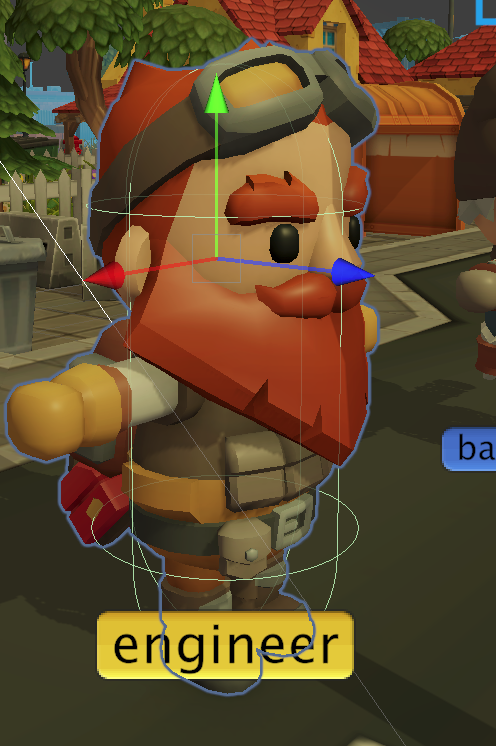
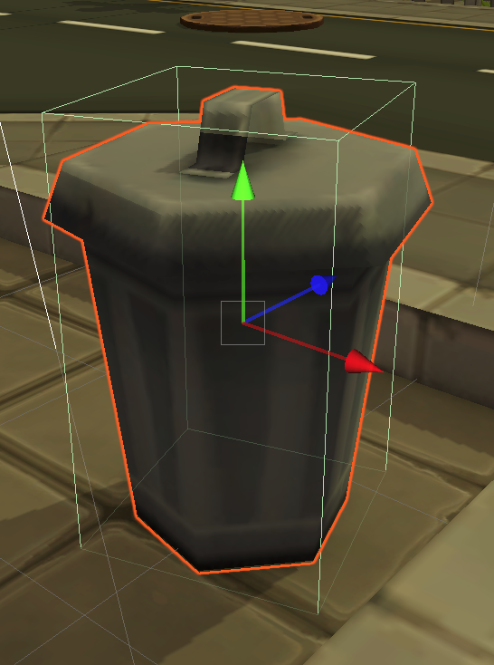
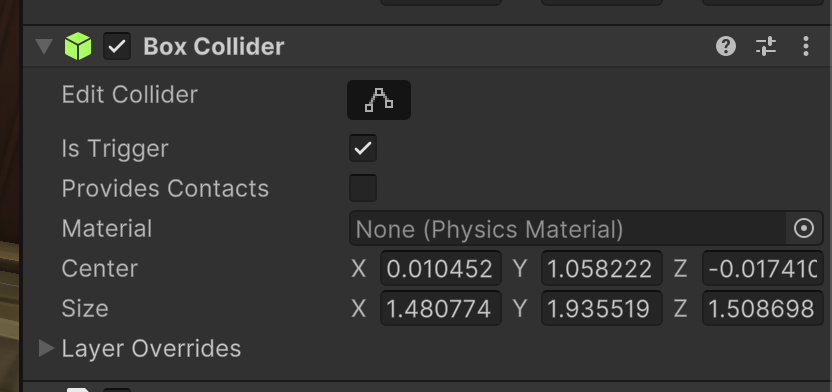

# Détection des collisions

Le moteur physique de Unity fournit un certain nombre d'outils qui aident à déterminer quand les objets entrent en collision.

Les collisions peuvent être interprétées de plusieurs façons :

- pour **déclencher** un événement (comme gagner un point)
- pour créer une **réponse physique**, comme être bloqué par un mur
- ...

Par défaut, les objets 3D ne participent pas au calcul des collisions physiques. Nous devons les ajouter au calcul en créant un volume de collision.

## Les collisionneurs

Un Collider est un composant que l'on ajoute à un GameObject afin d'indiquer au moteur Physics de le prendre en compte lors de la détection des collisions.

Il a une forme simplifiée en 3 dimensions, comme un cube, une sphère ou une capsule. 




Dans l'image, le personnage a un CapsuleCollider qui approxime sa forme dans la simulation physique, tandis que la poubelle a un BoxCollider.


## Rigidbody

Un composant Rigidbody indique au moteur physique qu'un objet se déplace de manière dynamique dans la simulation et qu'il doit recevoir et créer des forces à partir d'autres objets de la simulation.

En fait, le Rigibody modifie automatiquement notre composant Transform basé sur les forces physiques modélisées.


## Répondre à une collision

Lorsqu'une collision est détectée par le moteur physique, une série de méthodes est appelée sur tous les composants attachés à l'objet du jeu. Par exemple, nous pouvons détecter le moment où la collision est détectée pour la première fois :


```c#
void OnCollisionEnter(Collision c) {
    ...
}
```

Cette méthode, si elle est présente, sera appelée sur les deux parties prenant part à la collision. Les informations concernant l'autre partie et la collision elle-même peuvent être trouvées dans le paramètre `Collision`.

Vous pouvez répondre en détruisant l'autre objet, en vous téléportant ailleurs, ou toute autre logique que votre jeu peut exiger.

Il y a trois phases :

- Le début de la collision : [OnCollisionEnter](https://docs.unity3d.com/ScriptReference/Collider.OnCollisionEnter.html)
- Chaque image pendant que la collision se produit : [OnCollisionStay](https://docs.unity3d.com/ScriptReference/Collider.OnCollisionStay.html)
- La fin de la collision : [OnCollisionExit](https://docs.unity3d.com/ScriptReference/Collider.OnCollisionExit.html)


Jetez un coup d'oeil à l'exemple Pong (`Assets/Demos/Pong/PongBall.cs`) pour voir comment répondre à une collision entre la balle et les murs ou les pagaies.


## Triggers

Le problème d'une collision est que les deux parties reçoivent des forces à la suite d'une collision. 

Parfois, nous voulons simplement tester si un objet en touche un autre, mais sans les forces physiques. Dans ce cas, nous marquerons l'un des objets comme **Trigger** (généralement l'objet qui n'est pas en mouvement).

Cela se fait dans le composant Collider, en cochant l'option `Is Trigger` :



Cela signifie que n'importe quel objet peut entrer dans ce composant, sans qu'aucune force de répulsion ne soit appliquée. Cependant, nous pouvons toujours nous connecter aux événements de notre jeu :


```c#
void OnTriggerEnter(Collider other) {
    ...
}
```

Notez qu'il ne s'agit pas du même ensemble de méthodes appelées par Unity lorsqu'il s'agit de déclencheurs.

Les déclencheurs sont surtout utiles pour :

- détecter quand nous entrons ou sortons d'une zone (ouvrir une porte automatiquement, allumer une lumière, etc.)
- collecter des objets bonus dans la scène (pour augmenter notre score)
- toucher des hasards dans la scène (pour diminuer notre vie)
- ...

Un exemple de trigger peut être trouvé dans l'exemple MetaVerse, sous `Assets/Demos/MetaVers/Bonus.cs`


