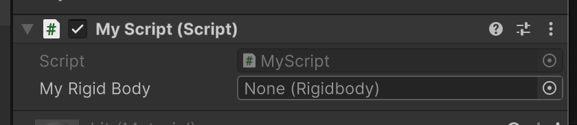

# Accès aux composants

Pour votre jeu, nous devons obtenir l'état du jeu en accédant aux composants, en lisant leurs valeurs et en envoyant ces valeurs sur un réseau.

Tous les composants dans Unity sont en fait des classes C#. Lorsqu'ils sont ajoutés à un GameObject, nous créons une instance de cette classe sur l'objet.

A tout moment, nous pouvons récupérer des références à ces instances.

## Création de variables publiques

Nous pouvons créer une variable publique en utilisant le type de classe et assigner manuellement la référence dans l'éditeur Unity.

Le code suivant fera apparaître un nouveau champ dans l'éditeur Unity :

```c#
class MyScript : Monobehavior {

    public Rigidbody MyRigidBody;

}
```


L'éditeur sera mis à jour sur tous les objets qui ont `MyScript` comme composant :



Vous pouvez maintenant sélectionner un composant Rigidbody dans le même objet, ou glisser-déposer un autre objet (qui a un composant Rigidbody) dans ce champ.

Vous pouvez alors accéder aux champs de ce composant via sa référence : 


```c#
Vector3 velocity = MyRigidBody.linearVelocity;
```

## Recherche dans le gameobjet

Alternativement, nous pouvons simplement rechercher un composant d'un type spécifique dans le même gameobjet.

La superclasse `Monobehaviour` expose une variable de commodité `gameObject`, qui référence l'entité à laquelle le composant est attaché. 

Nous pouvons faire des choses à l'entité comme obtenir son nom, la désactiver, etc. en utilisant la variable `gameObject`.


```c#
// prints the name of the gameObject to the console
Debug.Log(gameObject.name);
```

Plus intéressant encore, nous pouvons rechercher dans le GameObject un composant d'un type spécifique :


```c#
Rigidbody myRigidBody = gameObject.GetComponent<Rigidbody>();
```

## Les scripts en tant que composants

N'oubliez pas que nos scripts sont automatiquement des composants et qu'ils peuvent être recherchés :

```c#
// In another script attached to the gameobject, 
// we can search for the component of type MyScript
MyScript s = gameObject.GetComponent<MyScript>();
```