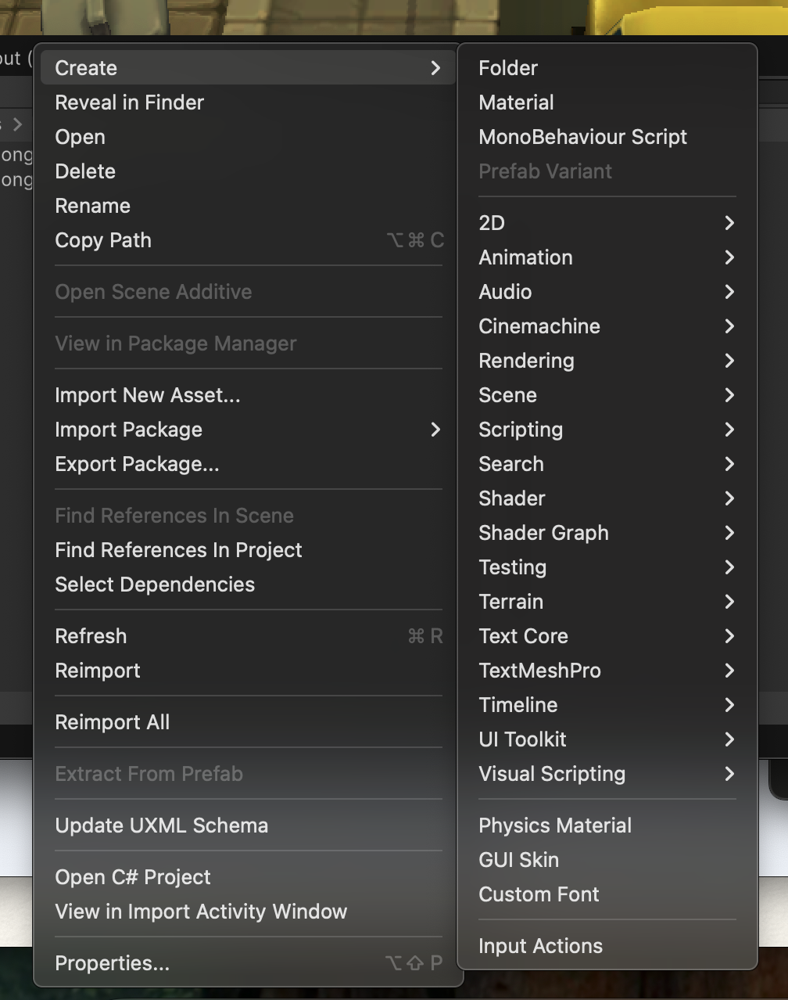
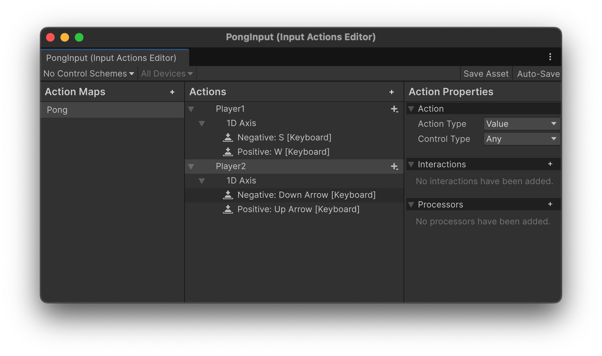
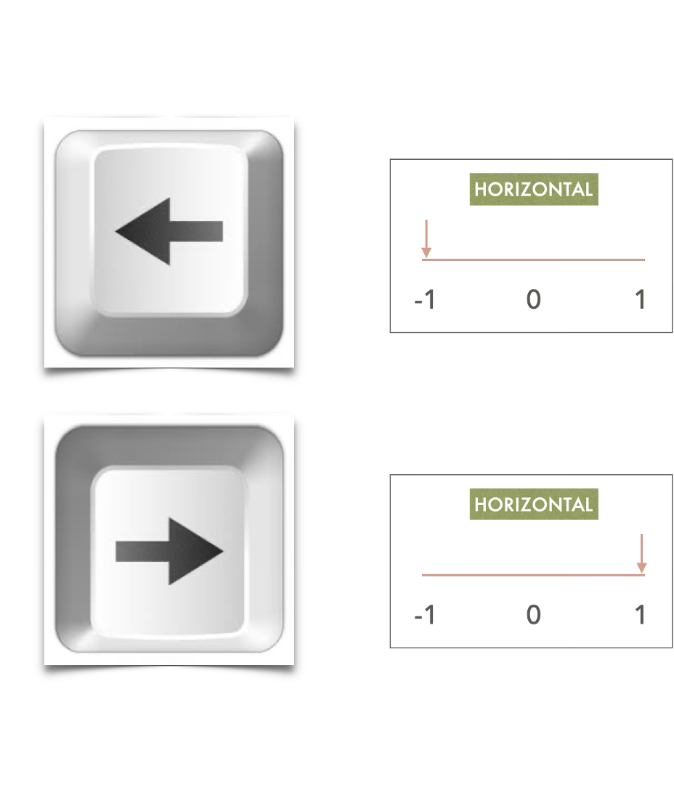

# Saisie au clavier

Le point d'entrée de l'interaction avec l'utilisateur est la possibilité de capturer les gestes de l'utilisateur via les appareils connectés et de les interpréter dans notre logique de jeu pour modifier l'état du jeu.

Par exemple, un utilisateur appuie sur la flèche du haut pour faire avancer son personnage. La touche « haut » est détectée et interprétée en modifiant la transformation de la position de l'utilisateur.

Unity a créé une couche d'abstraction pour les périphériques connectés, ce qui nous permet de nous concentrer sur notre gameplay, tout en permettant la prise en charge de plusieurs périphériques parallèles (claviers, manettes de jeu, etc.).

## Actions d'entrée

La première chose à faire est de créer un asset Input Actions dans la fenêtre Project.



Cette ressource stocke notre configuration d'entrée qui détaille les dispositifs que nous écoutons et leur correspondance avec les « actions » du jeu que nous utiliserons plus tard.

Double-cliquez sur cette ressource pour ouvrir l'éditeur d'actions d'entrée.



## Action Maps

Notre jeu peut se composer d'un certain nombre de scènes, de phases ou de zones différentes dans lesquelles les entrées peuvent être interprétées différemment.

Par exemple, une scène pour le menu du jeu peut nécessiter des entrées différentes d'une scène où nous contrôlons notre personnage sur terre, qui peut également être différente des entrées lorsque nous contrôlons notre personnage dans l'eau.

Vous pouvez créer plusieurs Action Maps, chacune comportant un certain nombre d'actions.

Vous remarquerez que chaque « action » contient une ou plusieurs « bindings » qui nous permettent de décider comment connecter un périphérique d'entrée à cette action.

Pour déplacer un personnage vers l'avant ou vers l'arrière, nous pouvons avoir les bindings suivantes :

- Flèches haut/bas du clavier
- Joystick d'une manette de jeu
- Mouvement vertical de la souris

Chacune de ces entrées entraînera une modification de la valeur de l'action. Regardez l'image suivante. L'action « Horizontal » représente une valeur flottante qui peut varier entre -1 et 1. Nous lions les touches fléchées horizontales à cette action. En appuyant sur la flèche gauche, la valeur descend à -1, et en appuyant sur la flèche droite, la valeur monte à 1.



Dans notre code, nous n'avons plus qu'à regarder la valeur de l'action, plutôt que de regarder spécifiquement les dispositifs.


## L'Action Map dans votre script

Pour utiliser la carte d'action dans votre script, sélectionnez d'abord la ressource dans la fenêtre Projet et cochez le champ « Generate C# class ». Cela créera une classe que nous pourrons utiliser dans notre code.

Dans notre code, nous pouvons maintenant lire et interpréter les valeurs d'action :

```c#

public class MyController {
    PongInput inputActions;
    InputAction PlayerAction;

    void Start() {
        inputActions = new PongInput();
        
        // Enable the action for player 1
        PlayerAction  = inputActions.Pong.Player1;
        PlayerAction.Enable();
    }

    void Update() {
        // Read the value from the input
        float direction = PlayerAction.ReadValue<float>();
        
        // Use the value to calculate the next position of my object
        Vector3 newPos = transform.position + (Vector3.up * Speed * direction * Time.deltaTime)
        ;

        // Update the position of my object
        transform.position = newPos;
    }

    void OnDisable() {
      PlayerAction.Disable();
    }
}
```