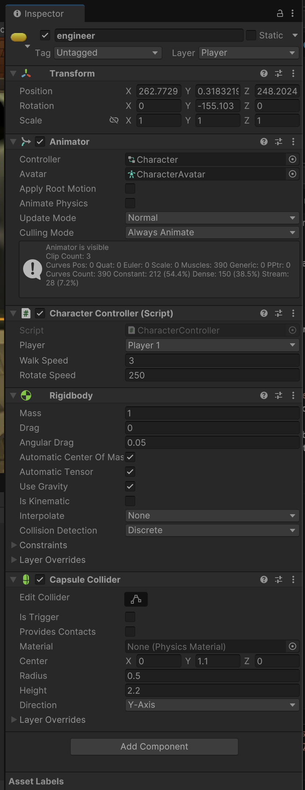

# The animation loop

Once started, unity executes what is essentially an enourmous `while (true)` loop :


What we want to do is insert our logic at certain points in this animation loop.

## Design pattern : Entity-Component

Unity adopts a version of the [Entity-Component](https://en.wikipedia.org/wiki/Entity_component_system) design pattern.

This makes for flexible creation of complex behaviours by just **composing** entities by mixing and matching different components.

Look at a character in the MetaVerse demo :



You will notice that the data fiels are grouped into components, and each component is responsible for a certain aspect of that entity's behaviour. For example :

- Transform : responsible for representing the object's position, rotation and scale
- Animator : responsible for deforming the 3D model to apply animations
- Rigidbody : responsible for giving the object physical behaviours (gravity, collisions)
- Character Controller : a custom script that I wrote for interpreting user input, and modifying other attached components accordingly (physics, transform), for moving the object around in the scene


You will notice at the top of the Inspector we can manage the name, visibilty, tags and layer of the object. This is the **entity** part of our design pattern. In Unity this entity is called the **GameObject**. This entity contains these few basic fields, but more importantly, contains a list of `Component` objects.

If we had to write some pseudo code for this entity class :

```c#

public class GameObject {

    public string name;
    public string tag;
    public List<Component> components = new List<Component>();

}

```


We can thus consider our scene to just be a list of GameObjects, each one customised with its own custom set of components. Here is a pseudo code representation of how the Unity Engine is constructed.

```c#
public class Scene {

    public List<GameObject> gameObjects = new List<GameObject>();


    void Loop() {

        while (true) {
            processFrame();
        }
    }

    void processFrame() {

        foreach (GameObject obj in gameObjects) {
            obj.Update();
        }

    }

}
```

Note the `Loop` function, which we would call when we start our animation loop. Basically it just iterates through all our entities, calling a generic `Update` method.

We can add this `Update` to our GameObject class :


```c#

public class GameObject {

    public string name;
    public string tag;
    public List<Component> components = new List<Component>();

    public void Update() {

        foreach (Component comp in components) {
            comp.Update();
        }

    }

}

```

Now, using the notion of **polymorphism*, each component in Unity extends the `Component` class and implements its own version of the `Update` method!

## Scripts

And indeed, we can create scripts in Unity, that are our own components (derive the `Component` super-class) that can override methods in order to hook into this animation loop. 

To create a script in Unity, right click in the Projects window and create the new `Monobehaviour Script` :


There are some restrictions when creating a script :

- The script filename must be identical to the classname inside the script
- No spaces or special characters in the class name
- The class must derive from the superclass `Monobehaviour` (which itself derives from `Component`).

Double click the script to open the associated Editor (Visual Studio or VSCode). The associated editor can be changed in Unity settings.

You will see the following boilerplate code :

```c#
using UnityEngine;

public class MyScript : MonoBehaviour
{
    // Start is called once before the first execution of Update after the MonoBehaviour is created
    void Start()
    {
        
    }

    // Update is called once per frame
    void Update()
    {
        
    }
}

```

Unity provide by default 2 hooks into its animation cycle :

- `Start` : a hook into the initialisation phase of the object. This function is called once at the first appearance of the object in the scene (at game start, or when the object is instantiated)
- `Update` : the method called by our animation loop at each frame.

Add the following line to the `Start` method :

```c#
Debug.Log("Hello world!");
```

In order to execute your script it needs to be attached to en entity (GameObject) present in the scene. You can either create an empty entity (menu GameObject -> Create Empty) or create a basic 3D model (GameObject -> 3D Object -> Cube).

Select your object in the Hierarchy. In the Inspector, click on "Add Component" and search for your script to add it to the object.

Start the game. You should see `Hello world!` in the Console window. 

Try moving the `Debug.Log` line into the `Update` method, and start the game. Do you understand what happens ?



You can get a full list of the animation loop hooks at the following reference : [https://docs.unity3d.com/ScriptReference/MonoBehaviour.html](https://docs.unity3d.com/ScriptReference/MonoBehaviour.html)




## Aller plus loin

If you are new to Unity and C# I would recommend following some tutorials offered by Unity :

- [Beginner Scripting](https://learn.unity.com/project/beginner-gameplay-scripting?uv=6&courseId=5c61706dedbc2a324a9b022d)

## My networked game

How does this apply to my networked game ? 

Well first of all, we can consider the **state** of our game to be our hierarchy, with all the entities and components, and the values stored in the fields of our components.

Some of this state must be synchronised with other instances of our game.

You will need to create components that :
1. recover the necessary state of an object (its position, for example, by accessing the Transform components)
2. serialize this information into a network packet
3. send this packet to another computer
4. deserialize the packet
5. apply the received state to the equivalent object on the destination machine (overwrite the position value in the Transform component)

