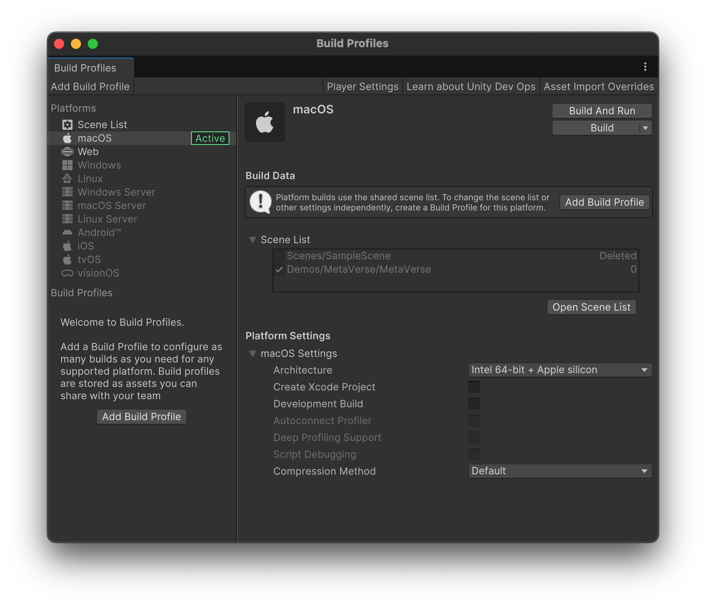

# Exportation d'un exécutable

Vous pouvez être amené à exporter fréquemment votre jeu sous forme d'exécutable afin de le tester sur d'autres ordinateurs.

Pour ce faire, vous devez aller dans Fichier -> Profils de construction.

Unity peut exporter des builds multiplateformes pour MacOS et Windows. 

Pour ajouter le support d'une cible spécifique, retournez dans Unity Hub, installez, et sélectionnez votre version actuelle de Unity. Vous pouvez modifier l'installation en cliquant sur le menu « Add Modules », et en ajoutant le support pour la plateforme désirée.

Cliquez sur « Build » pour créer votre exécutable !

