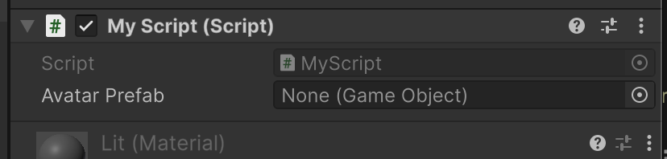

# Instantiation

Si vous rejoignez un MetaVerse par exemple, votre client peut avoir besoin d'instancier des GameObjects dans la scène représentant les autres joueurs.

Nous ne savons pas à l'avance combien ils sont, ni où ils se trouvent.

Lors de la première connexion, nous devons obtenir ces informations du serveur. Imaginons que nous recevions un json contenant ce qui suit :


```json
[
    {
        "name": "Player 1",
        "position": {
            "x": 35,
            "y": 0,
            "z": 5
        }
    },
     {
        "name": "Player 2",
        "position": {
            "x": 21,
            "y": 0,
            "z": 1
        }
    }
]
```

Que faisons-nous avec ces informations ? Comment créer 2 GameObjects aux positions indiquées ?

## Les préfabriqués (Prefabs)

Au coeur de l'instanciation se trouve la notion d'objet préfabriqué. 

Dans unity, nous pouvons sauvegarder la configuration d'un objet (sa liste de composants et ses valeurs de champs) sur le disque.

Pour ce faire, il suffit de faire glisser un objet de la vue Hiérarchie vers la fenêtre Projet. Un nouveau fichier est créé de type `.prefab` contenant ces informations.

Essayez donc !

Vous remarquerez que l'objet dans la vue Hiérarchie devient bleu, indiquant qu'il s'agit maintenant d'une instance d'un Prefab.

Le prefab devient le plan central de cet objet. Si je modifie le PRefab, cette modification est automatiquement appliquée à tous les objets instanciés à partir de ce Prefab !


## Instanciation

Supposons que nous ayons configuré un avatar représentant un joueur et créé un préfabriqué pour lui. Nous voulons instancier ce préfabriqué pour chaque joueur reçu :


```c#
public class MyScript : MonoBehaviour
{
    // The prefab to instantiate for each player
    public GameObject AvatarPrefab;

    void CreateAvatar(Vector3 position)
    {
        GameObject avatar = GameObject.Instantiate(AvatarPrefab);
        avatar.transform.position = position;
    }
}
```


Cela créera un champ dans l'éditeur Unity dans lequel nous devrons faire glisser le préfabriqué de préconfiguration :



Chaque fois que nous appelons `CreateAvatar`, cela va créer une nouvelle entité dans la scène basée sur notre blueprint, et changer sa position.

Notre blueprint peut contenir tous les scripts nécessaires pour animer et/ou recevoir des messages de synchronisation du réseau.

## Destruction

Lorsqu'un utilisateur quitte le jeu, nous devons supprimer l'entité associée à cet utilisateur.

Cela se fait simplement en appelant la fonction `Destroy`.


```c#
void RemoveAvatar(GameObject avatar) {
    Destroy(avatar);
}
```

