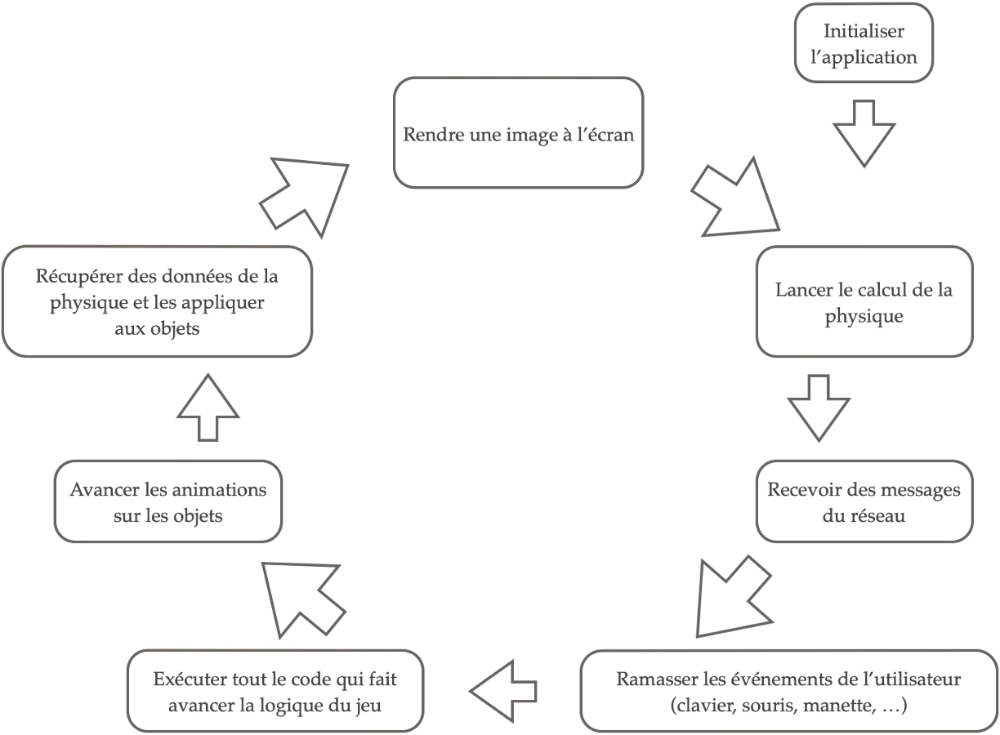
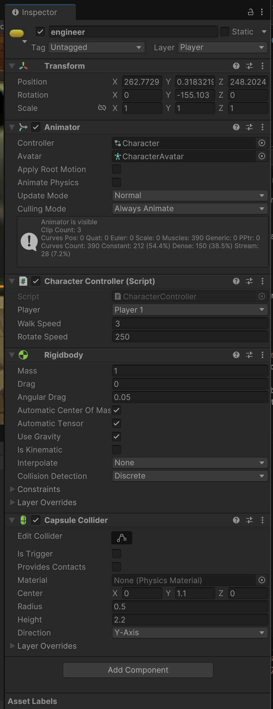
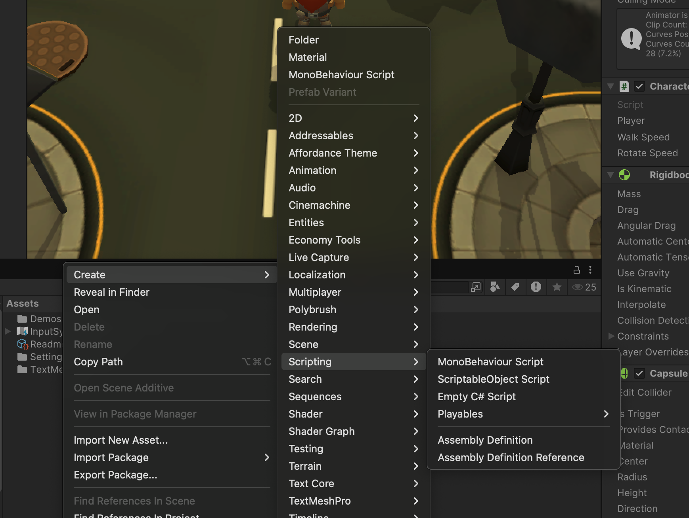

# La boucle d'animation

Une fois lancé, unity exécute ce qui est essentiellement une énorme boucle `while (true)` :



Ce que nous voulons faire, c'est insérer notre logique à certains points de cette boucle d'animation.

## Design pattern : Entity-Component

Unity adopte une version du modèle de conception [Entity-Component](https://en.wikipedia.org/wiki/Entity_component_system).

Cela permet la création flexible de comportements complexes en **composant** simplement  des entités en mélangeant et en associant différents composants.

Regardez un personnage dans la démo MetaVerse :



Vous remarquerez que les champs de données sont regroupés en composants, et que chaque composant est responsable d'un certain aspect du comportement de l'entité. Par exemple :

- Transform : responsable de la représentation de la position, de la rotation et de l'échelle de l'objet.
- Animator : responsable de la déformation du modèle 3D pour appliquer des animations
- Rigidbody : responsable de donner à l'objet des comportements physiques (gravité, collisions)
- Character Controller : un script personnalisé que j'ai écrit pour interpréter les entrées de l'utilisateur, et modifier les autres composants attachés en conséquence (physique, transformation), pour déplacer l'objet dans la scène.


Vous remarquerez qu'en haut de l'inspecteur, nous pouvons gérer le nom, la visibilité, les tags et le calque de l'objet. C'est la partie **entité** de notre design pattern. Dans Unity, cette entité est appelée **GameObject**. Cette entité contient ces quelques champs de base, mais plus important encore, elle contient une liste d'objets `Component`.

Si nous devions écrire un pseudo-code pour cette classe d'entité :


```c#

public class GameObject {

    public string name;
    public string tag;
    public List<Component> components = new List<Component>();

}

```


Nous pouvons donc considérer notre scène comme une simple liste d'objets de jeu, chacun étant personnalisé avec son propre ensemble de composants. Voici une représentation en pseudo-code de la façon dont le moteur Unity est construit.


```c#
public class Scene {

    public List<GameObject> gameObjects = new List<GameObject>();


    void Loop() {

        while (true) {
            processFrame();
        }
    }

    void processFrame() {

        foreach (GameObject obj in gameObjects) {
            obj.Update();
        }

    }

}
```

Notez la fonction `Loop`, que nous appellerons lorsque nous démarrerons notre boucle d'animation. Fondamentalement, elle itère à travers toutes nos entités, en appelant une méthode générique `Update`.

Nous pouvons ajouter cette méthode `Update` à notre classe GameObject :


```c#

public class GameObject {

    public string name;
    public string tag;
    public List<Component> components = new List<Component>();

    public void Update() {

        foreach (Component comp in components) {
            comp.Update();
        }

    }

}

```

Maintenant, en utilisant la notion de**polymorphisme*, chaque composant dans Unity étend la classe `Component` et implémente sa propre version de la méthode `Update` !


## Scripts

Et en effet, nous pouvons créer des scripts dans Unity, qui sont nos propres composants (dérivant de la super-classe `Component`) qui peuvent surcharger les méthodes afin de s'accrocher à cette boucle d'animation. 

Pour créer un script dans Unity, faites un clic droit dans la fenêtre Projects et créez le nouveau `Monobehaviour Script` :



Il y a quelques restrictions lors de la création d'un script :

- Le nom de fichier du script doit être identique au nom de classe à l'intérieur du script.
- Le nom de la classe ne doit pas contenir d'espaces ou de caractères spéciaux
- La classe doit dériver de la superclasse `Monobehaviour` (qui dérive elle-même de `Component`).

Double-cliquez sur le script pour ouvrir l'éditeur associé (Visual Studio ou VSCode). L'éditeur associé peut être modifié dans les paramètres d'Unity.

Vous verrez le code modèle suivant :

```c#
using UnityEngine;

public class MyScript : MonoBehaviour
{
    // Start is called once before the first execution of Update after the MonoBehaviour is created
    void Start()
    {
        
    }

    // Update is called once per frame
    void Update()
    {
        
    }
}

```

Unity fournit par défaut 2 points d'ancrage dans son cycle d'animation :

- `Start` : un hook dans la phase d'initialisation de l'objet. Cette fonction est appelée une fois lors de la première apparition de l'objet dans la scène (au début du jeu, ou lorsque l'objet est instancié).
- `Update` : la méthode appelée par notre boucle d'animation à chaque itération.

Ajoutez la ligne suivante à la méthode `Start` :

```c#
Debug.Log("Hello world !") ;
```

Afin d'exécuter votre script, il doit être attaché à une entité (GameObject) présente dans la scène. Vous pouvez soit créer une entité vide (menu GameObject -> Create Empty), soit créer un modèle 3D de base (GameObject -> 3D Object -> Cube).

Sélectionnez votre objet dans la Hiérarchie. Dans l'inspecteur, cliquez sur « Add Component » et recherchez votre script pour l'ajouter à l'objet.

Démarrez le jeu. Vous devriez voir `Hello world!` dans la fenêtre Console. 

Essayez de déplacer la ligne `Debug.Log` dans la méthode `Update`, et démarrez le jeu. Comprenez-vous ce qui se passe ?



Vous pouvez obtenir une liste complète des hooks de la boucle d'animation à la référence suivante : [https://docs.unity3d.com/ScriptReference/MonoBehaviour.html](https://docs.unity3d.com/ScriptReference/MonoBehaviour.html)




## Aller plus loin

Si vous êtes novice en matière de Unity et de C#, je vous recommande de suivre les tutoriels proposés par Unity :

- [Beginner Scripting](https://learn.unity.com/project/beginner-gameplay-scripting?uv=6&courseId=5c61706dedbc2a324a9b022d)

## Mon jeu en réseau

Comment cela s'applique-t-il à mon jeu en réseau ? 

Tout d'abord, nous pouvons considérer que l'état** de notre jeu est notre hiérarchie, avec toutes les entités et les composants, et les valeurs stockées dans les champs de nos composants.

Certains de ces états doivent être synchronisés avec d'autres instances de notre jeu.

Vous devrez créer des composants qui :
1. récupèrent l'état nécessaire d'un objet (sa position, par exemple, en accédant aux composants Transform)
2. sérialiser cette information dans un paquet réseau
3. envoyer ce paquet à un autre ordinateur
4. désérialiser le paquet
5. appliquer l'état reçu à l'objet équivalent sur la machine de destination (écraser la valeur de la position dans le composant Transform)


